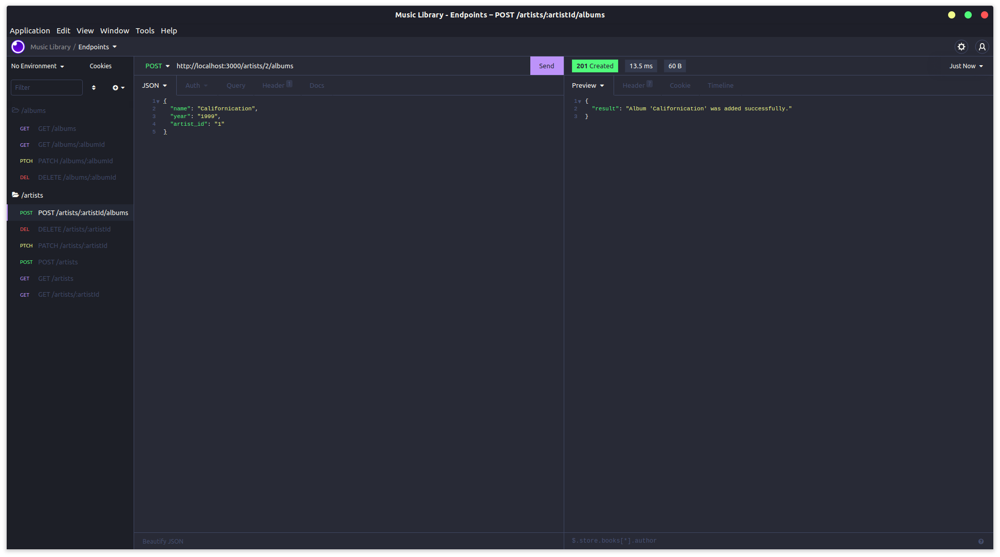
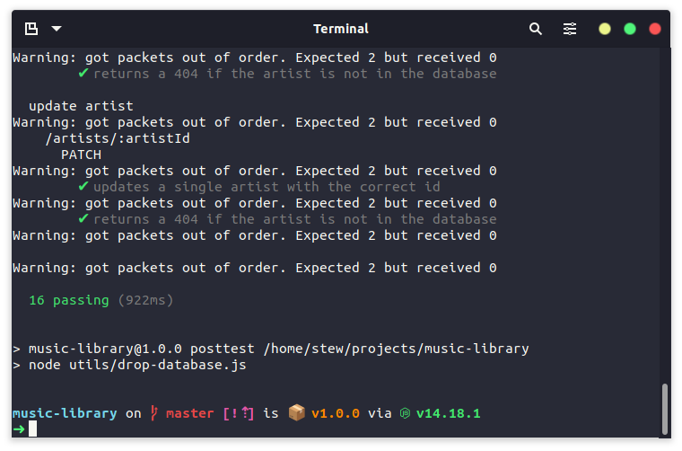

# MCR Codes Music Library

This is my music library project for [Manchester Codes](https://www.manchestercodes.com/) as part of the Backend module.

## Description

The main purpose of this project is to learn how to design and implement an API which can perform CRUD operations on a database.

## Features

Use RESTful routes to perform CRUD operations to store and manage your favourite music artists in a database.

## Requirements

- [Node JS](https://nodejs.org/en/) - to start the server.

### Application Dependencies

- [Express](https://expressjs.com/) - to set up the server and manage routes and responses.
- [MySQL2](https://github.com/sidorares/node-mysql2#readme) - to work with the MySQL database engine.

### Development Dependencies

- [Nodemon](https://nodemon.io/) - to run the 'npm start' script
- [Dotenv](https://github.com/motdotla/dotenv#readme) - to store environment variables
- [Mocha](https://mochajs.org/) - testing framework
- [Chai](https://www.chaijs.com/) - assertion library
- [SuperTest](https://github.com/visionmedia/supertest#readme) - http assertions with async/await

## Getting Started

- `docker pull bbatm9/music_library_mysql` more info: [DockerHub](https://hub.docker.com/r/bbatm9/music_library_mysql)
- `docker run -d -p <OUTSIDE_PORT>:<INSIDE_PORT> --name <NAME> -e MYSQL_ROOT_PASSWORD=<PASSWORD> <IMAGE_NAME>`.
- Execute the `git clone` command on this repository.
- `cd` into the repository directory.
- `npm install` to install dependencies.
- `touch .env` or manually create a `.env` file in the project root.
  - add the following:
  - DB_PASSWORD=<YOUR_PASSWORD>
  - DB_NAME=<YOUR_DB_NAME>
  - DB_USER=<YOUR_DB_USER>
  - DB_HOST=<YOUR_DB_HOST>
  - DB_PORT=<YOUR_DB_PORT>
  - PORT=<YOUR_APP_PORT>
- `npm start` to start the server.

## Documentation

### Artists

| HTTP Verb | Route                   | Example Request Body                                    |
| --------- | ----------------------- | ------------------------------------------------------- |
| GET       | /artist                 | N/A                                                     |
| GET       | /artist/:artistId       | N/A                                                     |
| POST      | /artist                 | {"name": "Some Artist", "genre": "Some Genre"}          |
| PATCH     | /artist/:artistId       | {"name": "Updated Artist"} (options: name, genre)       |
| DELETE    | /artist/:artistId       | N/A                                                     |
| POST      | /artist/:artistId/album | {"name": "Some Album", "year": "2022", "artistId": "1"} |

### Albums

| HTTP Verb | Route           | Example Request Body                                      |
| --------- | --------------- | --------------------------------------------------------- |
| GET       | /album          | N/A                                                       |
| GET       | /album/:albumId | N/A                                                       |
| PATCH     | /album/:albumId | {"name": "Updated Album"} (options: name, year, artistId) |
| DELETE    | /album/:albumId | N/A                                                       |

## Testing

Built using a TDD approach. Tests are focused on end-to-end testing. Each route/controller was first written as a failing test, which was then built out as per the tests, and later refactored and tested again.

All tests are located inside of the `__tests__` directory.

If you wish to run the tests for yourself, you can install Mocha by running `npm install` and from there you can run the tests by running `npm test`.

I also used [Insomnia](https://insomnia.rest/) to send requests to my RESTful API endpoints as documented above.

